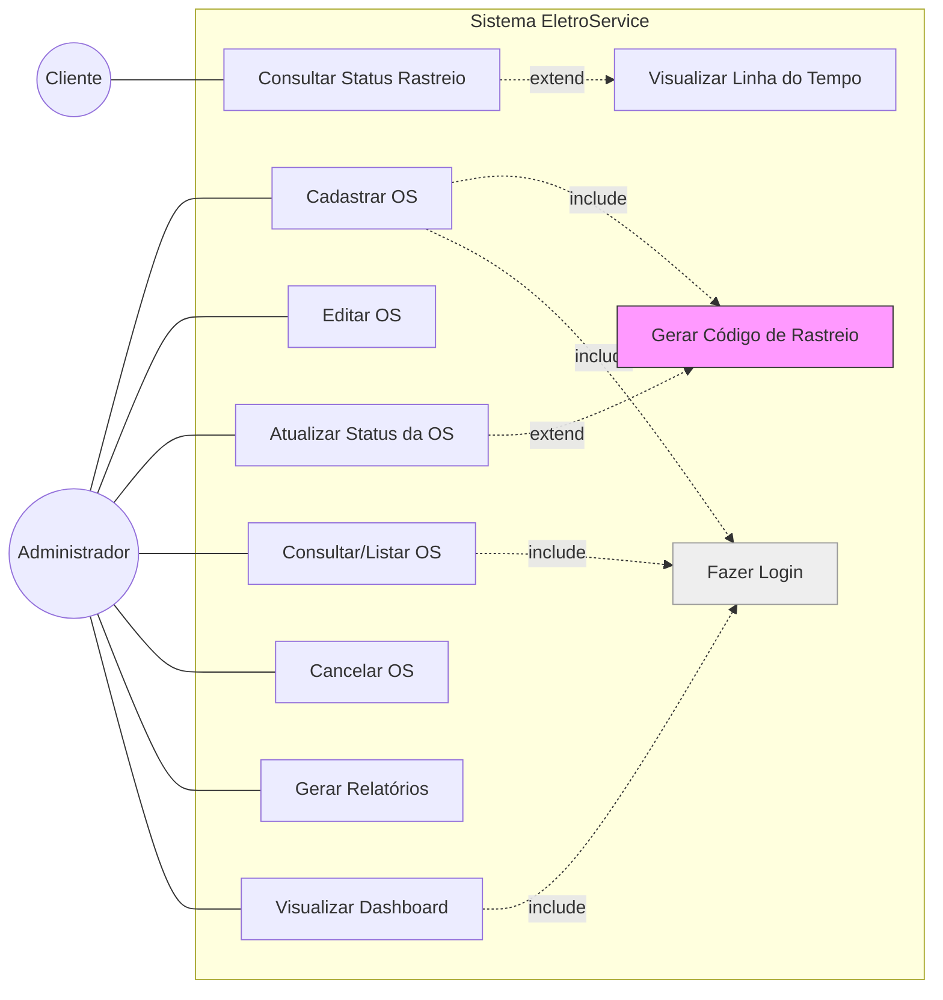
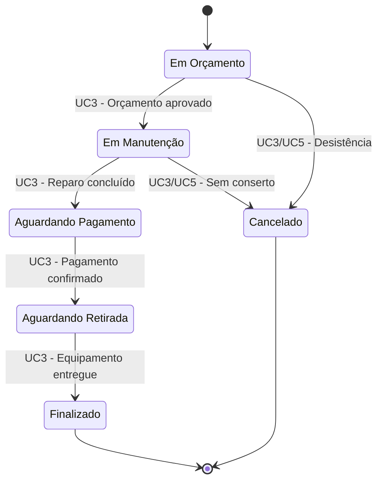

---

### Diagrama de Casos de Uso - EletroService (Revisado)

---

### Atores do Sistema

| Ator | Tipo | Descrição |
| :--- | :--- | :--- |
| **Administrador** | Humano | Usuário autenticado com acesso completo ao sistema. Gerencia ordens de serviço, executa operações de balcão, parametriza o sistema e gera relatórios gerenciais. Acumula as funções do antigo Operador. |
| **Usuário Comum (Cliente)** | Humano | Dono do equipamento em manutenção. Não possui autenticação. Acessa apenas o Módulo de Transparência para acompanhar sua OS via código de rastreamento. |
| **Sistema** | Interno | Ator automatizado responsável por tarefas em segundo plano, como a geração de códigos únicos de rastreamento. |

---

### Detalhamento Completo dos Casos de Uso

#### Área Administrativa (Acesso Restrito — Requer Login)

**UC1 — Cadastrar Ordem de Serviço**

| Campo | Descrição |
| :--- | :--- |
| **Ator Principal** | Administrador |
| **Objetivo** | Registrar uma nova Ordem de Serviço no sistema, dando início formal ao ciclo de vida da manutenção. |
| **Pré-condição** | Administrador autenticado no sistema. |
| **Gatilho** | Cliente entrega um equipamento para reparo ou solicita um serviço. |
| **Fluxo Principal** | 1. Admin acessa a tela de abertura de OS. 2. Preenche dados do cliente (nome, contato). 3. Registra informações do equipamento (tipo, marca, modelo). 4. Descreve o problema relatado pelo cliente. 5. Confirma o cadastro. 6. Sistema gera automaticamente um **código de rastreamento único** («include» UC8). 7. Sistema posiciona a OS no estado inicial "Em Orçamento". |
| **Pós-condição** | OS criada com status "Em Orçamento". Código de rastreamento disponível para entrega ao cliente. |

---

**UC2 — Editar Ordem de Serviço**

| Campo | Descrição |
| :--- | :--- |
| **Ator Principal** | Administrador |
| **Objetivo** | Corrigir ou complementar dados existentes de uma OS que não foram registrados corretamente no cadastro inicial. |
| **Pré-condição** | Admin autenticado. OS deve existir no sistema. |
| **Gatilho** | Erro de digitação, informação equivocada ou necessidade de acrescentar observações internas. |
| **Fluxo Principal** | 1. Admin localiza a OS via consulta (UC4). 2. Acessa o modo de edição. 3. Altera campos permitidos (ex: descrição do defeito, observações técnicas, dados de contato do cliente). 4. Salva as alterações. |
| **Pós-condição** | Dados da OS atualizados. Histórico interno registra a modificação. |
| **Observação** | Não altera o status da OS. Para isso, utiliza-se o UC3. |

---

**UC3 — Atualizar Status da OS**

| Campo | Descrição |
| :--- | :--- |
| **Ator Principal** | Administrador |
| **Objetivo** | Avançar a Ordem de Serviço dentro do fluxo de trabalho pré-definido, refletindo o progresso real do serviço. |
| **Pré-condição** | Admin autenticado. OS deve estar em um status válido para transição. |
| **Gatilho** | Conclusão de uma etapa (orçamento aprovado, reparo iniciado, peça recebida, serviço finalizado, pagamento efetuado). |
| **Fluxo Principal** | 1. Admin consulta a OS. 2. Seleciona a opção "Atualizar Status". 3. Escolhe o novo status permitido pela máquina de estados. 4. Opcionalmente, insere uma observação (ex: "Aguardando retirada — balcão 3"). 5. Confirma a transição. 6. Sistema registra a mudança na **linha do tempo** («include» UC8). |
| **Pós-condição** | Status da OS atualizado. Cliente pode visualizar o novo status e a linha do tempo atualizada (UC9, UC10). |

---

**UC4 — Consultar e Listar Ordens de Serviço**

| Campo | Descrição |
| :--- | :--- |
| **Ator Principal** | Administrador |
| **Objetivo** | Localizar e visualizar uma ou mais Ordens de Serviço com base em critérios de filtro. |
| **Pré-condição** | Admin autenticado. |
| **Gatilho** | Necessidade de verificar pendências, localizar uma OS específica ou acompanhar o volume de serviços. |
| **Fluxo Principal** | 1. Admin acessa a tela de consulta/lista de OS. 2. Aplica filtros opcionais (por status, por período de abertura, por nome do cliente). 3. Visualiza a lista resumida de OS correspondentes. 4. Pode selecionar uma OS para ver seus detalhes completos (incluindo a linha do tempo técnica). |
| **Pós-condição** | Informações das OS exibidas conforme os filtros aplicados. |

---

**UC5 — Cancelar Ordem de Serviço**

| Campo | Descrição |
| :--- | :--- |
| **Ator Principal** | Administrador |
| **Objetivo** | Encerrar formalmente uma OS que não prosseguirá, registrando o motivo do cancelamento. É um status final. |
| **Pré-condição** | Admin autenticado. OS não pode estar em status "Finalizado". |
| **Gatilho** | Cliente desiste do orçamento, equipamento não tem conserto viável, ou outro motivo de desistência. |
| **Fluxo Principal** | 1. Admin localiza a OS (UC4). 2. Seleciona a opção "Cancelar OS". 3. Seleciona ou descreve o motivo do cancelamento (ex: "Desistência do cliente", "Sem peças disponíveis"). 4. Confirma a operação. 5. Sistema move a OS para o status "Cancelado" e registra na linha do tempo (UC8). |
| **Pós-condição** | OS com status "Cancelado". Não pode mais ser alterada. Cliente visualiza o cancelamento via UC9 e UC10. |

---

**UC6 — Gerar Relatório de Entrada e Saída**

| Campo | Descrição |
| :--- | :--- |
| **Ator Principal** | Administrador |
| **Objetivo** | Emitir um relatório detalhado com as Ordens de Serviço abertas e fechadas (finalizadas ou canceladas) dentro de um intervalo de datas específico. |
| **Pré-condição** | Admin autenticado. Existência de OS no período consultado. |
| **Gatilho** | Necessidade de análise gerencial, conferência de faturamento mensal, auditoria. |
| **Fluxo Principal** | 1. Admin acessa o módulo de relatórios. 2. Define o período desejado (data inicial e data final). 3. Solicita a geração do relatório de Entrada e Saída. 4. Sistema compila as OS abertas e fechadas no intervalo, com seus respectivos status finais. 5. Admin pode visualizar, imprimir ou exportar o relatório. |
| **Pós-condição** | Relatório gerado e disponível para o administrador. |

---

**UC7 — Visualizar Dashboard de Métricas**

| Campo | Descrição |
| :--- | :--- |
| **Ator Principal** | Administrador |
| **Objetivo** | Acessar um painel visual com indicadores e gráficos em tempo real sobre a produtividade e situação geral das Ordens de Serviço. |
| **Pré-condição** | Admin autenticado. |
| **Gatilho** | Monitoramento proativo da operação, identificação de gargalos (ex: muitas OS paradas em "Aguardando Peça"). |
| **Fluxo Principal** | 1. Admin acessa o Dashboard na tela inicial ou menu principal. 2. Visualiza gráficos como:    - Distribuição de OS por status atual (pizza/barras).    - Volume de OS abertas vs. finalizadas por dia/semana (linha).    - Tempo médio em cada etapa do fluxo. |
| **Pós-condição** | Admin obtém uma visão macro do desempenho da assistência técnica. |

---

#### Módulo de Transparência ao Cliente (Acesso Público — Sem Login)

**UC8 — Gerar Código de Rastreamento**

| Campo | Descrição |
| :--- | :--- |
| **Ator Principal** | Sistema |
| **Objetivo** | Criar e registrar um código alfanumérico único que permite ao cliente acompanhar sua OS de forma segura e privada. |
| **Pré-condição** | Executado automaticamente como parte de uma transação maior. |
| **Gatilho** | Conclusão bem-sucedida de um **cadastro de OS (UC1)** ou de uma **atualização de status (UC3)**. |
| **Fluxo Principal** | 1. Sistema detecta evento (abertura de OS ou mudança de status). 2. Se for abertura, gera hash único e associa à OS (ex: `#ELE-2026-A3F9`). 3. Se for mudança de status, registra entrada no histórico vinculado ao código (timestamp, status novo). |
| **Pós-condição** | Código gerado (na abertura) e linha do tempo interna incrementada (na atualização), disponíveis para consulta pública pelo UC9. |

---

**UC9 — Consultar Status por Código de Rastreamento**

| Campo | Descrição |
| :--- | :--- |
| **Ator Principal** | Usuário Comum (Cliente) |
| **Objetivo** | Verificar a situação atual de sua manutenção utilizando o código único fornecido pela assistência técnica. |
| **Pré-condição** | Nenhuma. Acesso é público, sem autenticação. Cliente deve possuir o código de rastreamento. |
| **Gatilho** | Cliente deseja saber o andamento do serviço de seu equipamento. |
| **Fluxo Principal** | 1. Cliente acessa a página pública de rastreamento. 2. Insere seu código no campo de busca. 3. Submete a consulta. 4. Sistema retorna o **status atual** da OS (ex: "Em Manutenção"). 5. Sistema oferece a opção de expandir para ver a "Linha do Tempo" («extend» para UC10). |
| **Pós-condição** | Cliente visualiza o status atualizado e tem a opção de acessar o histórico completo. |

---

**UC10 — Visualizar Linha do Tempo da Manutenção**

| Campo | Descrição |
| :--- | :--- |
| **Ator Principal** | Usuário Comum (Cliente) |
| **Objetivo** | Obter o histórico cronológico e completo do progresso da Ordem de Serviço, conferindo máxima transparência ao processo de reparo. |
| **Pré-condição** | Cliente deve ter executado a consulta inicial via código de rastreamento (UC9). |
| **Gatilho** | Cliente, vendo o status atual, deseja mais detalhes sobre o histórico do serviço. |
| **Fluxo Principal** | 1. Após o UC9, cliente clica em "Ver histórico completo" ou similar. 2. Sistema exibe uma lista cronológica com cada evento registrado para a OS:    - Data e hora    - Status que a OS entrou    - Descrição amigável (ex: "Seu equipamento entrou em manutenção técnica") |
| **Pós-condição** | Cliente visualiza todo o caminho percorrido pelo equipamento dentro da assistência técnica. |

---

### Fluxo de Status da Ordem de Serviço (Máquina de Estados)

O diagrama abaixo representa o ciclo de vida completo da OS, conforme você especificou. O caso de uso **UC3 (Atualizar Status)** é o responsável por efetivar cada uma destas transições, validando as regras de negócio.

| Estado | Descrição |
| :--- | :--- |
| **Em Orçamento** | OS recém-criada. Técnico analisa o equipamento e prepara o orçamento para aprovação do cliente. Estado inicial. |
| **Em Manutenção** | Orçamento aprovado pelo cliente. Equipamento em reparo efetivo na bancada. |
| **Aguardando Pagamento** | Serviço técnico concluído. Cliente precisa efetuar o pagamento para liberação. |
| **Aguardando Retirada** | Pagamento confirmado. Equipamento pronto, aguardando o cliente retirar no balcão. |
| **Finalizado** | Estado final. Cliente retirou o equipamento e o ciclo de vida se encerra com sucesso. |
| **Cancelado** | Estado final. OS interrompida por desistência, falta de peças, equipamento irrecuperável ou outro motivo. |