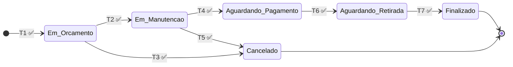

# Plano de Testes TDD-First — EletroService

**Versão:** 1.0  
**Data:** 27/04/2026  
**Autor:** Yure Samarone Gomes Duarte  
**Metodologia:** TDD (Test-Driven Development)

---

## 1. Introdução

Este documento define a estratégia de testes automatizados do sistema **EletroService**, uma plataforma web Flask para gestão do ciclo de vida de Ordens de Serviço (OS). A abordagem segue o paradigma **TDD-First**, onde os testes são escritos antes ou em conjunto com o código funcional, servindo como especificação executável do comportamento esperado.

### 1.1 Objetivos

- Validar **todas as funcionalidades** definidas nos documentos de requisitos e casos de uso
- Garantir **cobertura da máquina de estados** da OS (6 status, 7 transições)
- Prevenir **regressões** em alterações futuras do código
- Fornecer **documentação viva** do comportamento do sistema

### 1.2 Documentos de Referência

| Documento | Conteúdo |
|---|---|
| `docs/Casos de Uso.md` | 11 casos de uso (UC1–UC11), diagramas, fluxos principal/alternativo |
| `docs/Requisitos Funcionais e Não funcionais.md` | 10 requisitos funcionais (F1.1–F3.3) com criticidade |
| `docs/DER.mermaid` | Diagrama Entidade-Relacionamento (4 entidades) |
| `docs/Fluxo de Status.mermaid` | Máquina de estados da OS (6 status, 7 transições) |

---

## 2. Arquitetura de Testes

### 2.1 Stack de Testes

| Ferramenta | Versão | Finalidade |
|---|---|---|
| **pytest** | 8.3.4 | Framework principal de testes |
| **pytest-cov** | 6.0.0 | Relatório de cobertura de código |
| **pytest-flask** | 1.3.0 | Integração pytest + Flask (test client) |
| **factory-boy** | 3.3.1 | Fábricas de objetos de teste |
| **faker** | 33.3.1 | Geração de dados falsos realísticos |

### 2.2 Estrutura de Diretórios

```
tests/
├── __init__.py                     # Pacote de testes
├── conftest.py                     # Fixtures globais (app, db, client, dados)
├── test_models.py                  # Modelos e regras de negócio
├── test_forms.py                   # Validação de formulários WTForms
├── test_auth_controller.py         # UC11 — Autenticação
├── test_work_order_controller.py   # UC1–UC5, UC9, UC10 — Ordens de Serviço
├── test_report_controller.py       # UC6, UC7 — Relatórios e Dashboard
├── test_user_controller.py         # Gestão de usuários
└── test_cli.py                     # Comando CLI create-user
```

### 2.3 Configuração de Teste (`TestingConfig`)

```python
class TestingConfig(Config):
    TESTING = True
    SQLALCHEMY_DATABASE_URI = 'sqlite:///:memory:'  # Banco em memória
    WTF_CSRF_ENABLED = False                         # CSRF desabilitado
    SERVER_NAME = 'localhost'
```

### 2.4 Estratégia de Isolamento

- **Banco em memória**: Cada teste usa SQLite `:memory:` com `create_all()`/`drop_all()` por função
- **CSRF desabilitado**: Permite testar formulários sem tokens
- **Fixtures por função**: Dados recriados a cada teste (sem estado compartilhado)
- **Autenticação via fixture**: `authenticated_client` faz login automático antes dos testes

---

## 3. Rastreabilidade — Casos de Uso × Testes

### 3.1 Área Administrativa (Acesso Restrito)

| UC | Caso de Uso | Requisito | Arquivo de Teste | Cenários |
|---|---|---|---|---|
| **UC1** | Cadastrar OS | F1.1 | `test_work_order_controller.py` | Criar OS válida; Criar novo Requester; Reusar Requester existente; Verificar status inicial "Em Orçamento"; Gerar `number` e `public_id` (UC8); Criar histórico inicial |
| **UC2** | Editar OS | F1.2 | `test_work_order_controller.py` | Editar descrição; Verificar 404 para OS inexistente |
| **UC3** | Atualizar Status | F1.3 | `test_work_order_controller.py` | 6 transições válidas (T2–T7); Impedir avanço de terminal; Registrar histórico; Ciclo completo |
| **UC4** | Consultar/Listar | F1.4 | `test_work_order_controller.py` | Listar vazia; Listar com dados |
| **UC5** | Cancelar OS | F1.5 | `test_work_order_controller.py` | Cancelar de "Em Orçamento" (T3); Cancelar de "Em Manutenção" (T5); Impedir cancelamento indevido; Registrar motivo e histórico |
| **UC6** | Gerar Relatórios | F2.1 | `test_report_controller.py` | Relatório com/sem datas; Datas inválidas; OS no período |
| **UC7** | Dashboard | F2.2 | `test_report_controller.py` | Acesso; APIs JSON (status-data, daily-data); Dashboard com/sem dados |
| **UC11** | Fazer Login | — | `test_auth_controller.py` | Login válido; Email inválido; Senha incorreta; Redirect autenticado; Logout; Proteção de 4 rotas |

### 3.2 Módulo de Transparência (Acesso Público)

| UC | Caso de Uso | Requisito | Arquivo de Teste | Cenários |
|---|---|---|---|---|
| **UC8** | Gerar Código Rastreio | F3.1 | `test_models.py` | Geração automática de `public_id` (UUID); Geração de `number` (formato `OS-YYYYMMDD-XXXX`); Unicidade de ambos |
| **UC9** | Consultar por Rastreio | F3.2 | `test_work_order_controller.py` | Consulta com ID válido; Consulta com ID inexistente (404) |
| **UC10** | Linha do Tempo | F3.3 | `test_work_order_controller.py` + `test_models.py` | Histórico com timestamp; Transição registra `old_status`/`new_status`; Dados exibidos na página |

---

## 4. Cenários de Teste Detalhados

### 4.1 Máquina de Estados (Prioridade Crítica)

A máquina de estados é o núcleo da lógica de negócio e possui **cobertura de 100%** das transições.



#### Transições Válidas

| ID | De | Para | Teste | Arquivo |
|---|---|---|---|---|
| T1 | `[*]` (abertura) | Em Orçamento | `test_criar_os_com_dados_validos` | `test_work_order_controller.py` |
| T2 | Em Orçamento | Em Manutenção | `test_t2_avancar_em_orcamento_para_manutencao` | `test_work_order_controller.py` |
| T3 | Em Orçamento | Cancelado | `test_t3_cancelar_em_orcamento` | `test_work_order_controller.py` |
| T4 | Em Manutenção | Aguardando Pagamento | `test_t4_avancar_manutencao_para_aguardando_pagamento` | `test_work_order_controller.py` |
| T5 | Em Manutenção | Cancelado | `test_t5_cancelar_em_manutencao` | `test_work_order_controller.py` |
| T6 | Aguardando Pagamento | Aguardando Retirada | `test_t6_avancar_aguardando_pagamento_para_retirada` | `test_work_order_controller.py` |
| T7 | Aguardando Retirada | Finalizado | `test_t7_avancar_aguardando_retirada_para_finalizado` | `test_work_order_controller.py` |

#### Transições Inválidas (Testes Negativos)

| Cenário | Teste |
|---|---|
| Não avançar de Finalizado | `test_nao_avancar_de_finalizado` |
| Não avançar de Cancelado | `test_nao_avancar_de_cancelado` |
| Não cancelar de Aguardando Pagamento | `test_nao_cancelar_aguardando_pagamento` |
| Não cancelar de Aguardando Retirada | `test_nao_cancelar_aguardando_retirada` |

#### Teste de Integração

| Cenário | Teste |
|---|---|
| Ciclo completo T1→T2→T4→T6→T7 | `test_ciclo_completo_happy_path` |

### 4.2 Models (`test_models.py`)

| Classe | Cenários | Total |
|---|---|---|
| `User` | Criação, `set_password`, `check_password`, `__repr__`, `is_authenticated` | 5 |
| `Requester` | Criação, `user_id` opcional, relacionamento User, relacionamento WorkOrders, `__repr__` | 5 |
| `WorkOrder` | Status padrão, geração `number`, geração `public_id`, unicidade, relacionamentos, cascade delete, `__repr__`, campos financeiros, campos cancelamento | 11 |
| `HistoryOrder` | Histórico inicial, timestamp, transição, `__repr__` | 4 |
| `STATUS_TRANSITIONS` | 6 status, flags `can_cancel`, `next` de cada status | 12 |

### 4.3 Formulários (`test_forms.py`)

| Form | Cenários | Total |
|---|---|---|
| `LoginForm` | Válido, email obrigatório, senha obrigatória, email inválido | 4 |
| `WorkOrderForm` | Válido, 5 campos obrigatórios, descrição min 10 chars, data opcional | 8 |
| `WorkOrderEditForm` | Válido, financeiros opcionais, cancelamento opcional, nota opcional | 4 |
| `UserCreateForm` | Válido, senha mín 6 chars, email inválido | 3 |
| `UserEditForm` | Senha opcional, senha curta | 2 |

### 4.4 Controllers

| Controller | Arquivo | Cenários | Total |
|---|---|---|---|
| Auth | `test_auth_controller.py` | Login/Logout/Proteção de rotas | 12 |
| Work Order | `test_work_order_controller.py` | CRUD + Estado + Rastreio + Integração | 20 |
| Report | `test_report_controller.py` | Relatórios + Dashboard + APIs | 10 |
| User | `test_user_controller.py` | CRUD + Duplicata + 404 | 10 |

### 4.5 CLI (`test_cli.py`)

| Cenário | Total |
|---|---|
| Criar usuário; Duplicata | 2 |

---

## 5. Estratégia de Mocks e Dependências

| Dependência | Estratégia de Mock/Isolamento |
|---|---|
| **Banco de Dados** | SQLite `:memory:` — recriado por teste (`create_all`/`drop_all`) |
| **CSRF Token** | `WTF_CSRF_ENABLED = False` na `TestingConfig` |
| **Autenticação** | Fixture `authenticated_client` faz `POST /auth/login` antes dos testes |
| **Sessões Flask** | `app.test_client()` com `TESTING = True` |
| **Dados de Teste** | Fixtures `sample_user`, `sample_requester`, `sample_work_order` |

---

## 6. Execução dos Testes

### 6.1 Via Docker Compose (Recomendado)

```bash
# Executar toda a suíte
docker compose exec web python -m pytest tests/ -v --tb=short

# Executar com relatório de cobertura
docker compose exec web python -m pytest tests/ --cov=app --cov-report=term-missing

# Executar um módulo específico
docker compose exec web python -m pytest tests/test_work_order_controller.py -v

# Executar um teste específico
docker compose exec web python -m pytest tests/test_work_order_controller.py::TestAtualizarStatus::test_ciclo_completo_happy_path -v
```

### 6.2 Via Ambiente Virtual Local

```bash
source venv/bin/activate
pip install -r requirements.txt
pytest tests/ -v --tb=short
```

---

## 7. Resultados da Execução Inicial

**Data:** 27/04/2026  
**Resultado:** ✅ **124 testes passaram (100%)**  
**Tempo de execução:** ~35s

### Cobertura de Código

| Módulo | Stmts | Miss | Cover |
|---|---|---|---|
| `app/models/` (todos) | 78 | 0 | **100%** |
| `app/forms/` (todos) | 47 | 0 | **100%** |
| `app/controllers/auth_controller.py` | 29 | 0 | **100%** |
| `app/controllers/main_controller.py` | 7 | 0 | **100%** |
| `app/controllers/user_controller.py` | 52 | 1 | **98%** |
| `app/controllers/work_order_controller.py` | 102 | 12 | **88%** |
| `app/controllers/report_controller.py` | 99 | 13 | **87%** |
| `app/config.py` | 18 | 0 | **100%** |
| `app/extensions.py` | 8 | 0 | **100%** |
| `app/cli.py` | 25 | 3 | **88%** |
| **TOTAL** | **496** | **30** | **94%** |

---

## 8. Critérios de Aceitação

- [x] Todos os 124 testes passam
- [x] Cada caso de uso (UC1–UC11) possui testes correspondentes
- [x] 100% das transições da máquina de estados cobertas (válidas e inválidas)
- [x] Teste de integração de ciclo completo (happy path)
- [x] Testes isolados (sem dependência de estado entre testes)
- [x] Cobertura geral ≥ 90% (alcançado: 94%)
- [x] Modelos e formulários com cobertura de 100%
